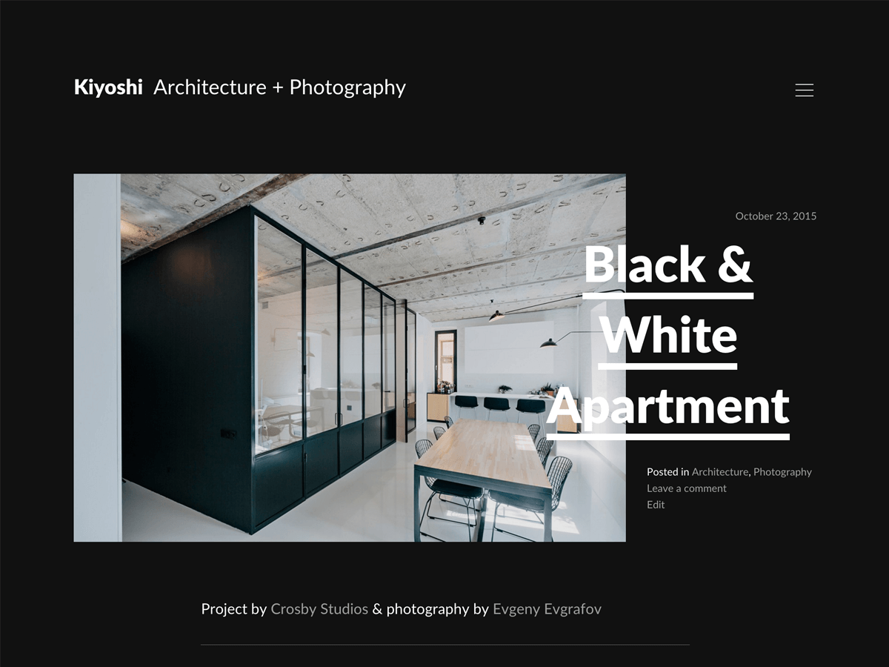

# Kiyoshi - Edgy WordPress theme crafted for creative publishers

Kiyoshi is an edgy WordPress theme which is crafted especially for creative publishers. The theme’s extra-ordinary and responsive layout makes your stream of posts look outstanding and unique. Kiyoshi is targeted to architects, photographers and other aesthetically driven folks.

[Theme Site](https://felixdorner.de/kiyoshi) / [Download Theme](https://wordpress.org/themes/kiyoshi/)

## Support

As this is a free theme, support is very limited. The community may help out in the designated [support forum](https://wordpress.org/support/theme/kiyoshi).

## Contributing

**Found a bug? Please report the issue [here](https://github.com/felixdorner/kiyoshi/issues)!** Want to contribute a patch or create a new feature? Just send me a pull request and I will review it.

Would you like to translate Kiyoshi in to your language? Get involved [here](https://translate.wordpress.org/projects/wp-themes/kiyoshi) and help to make this theme even more accessible.

## Author

**Felix Dorner**  
*Designer and developer*

- [Website](https://felixdorner.de)
- [Twitter](https://twitter.com/felixdorner)
- [Dribbble](https://www.dribbble.com/felixdorner)
